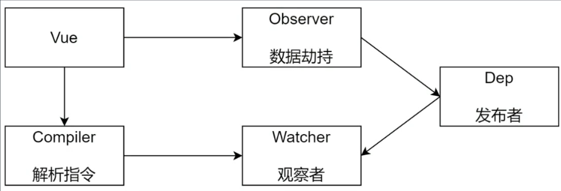
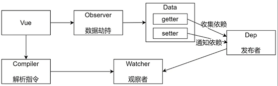
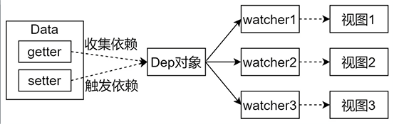
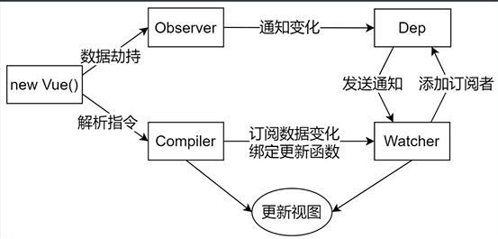

## Vue

- 功能
  - 负责接收初始化的参数(选项)
  - 负责把data中的属性注入到Vue实例中，转换成getter/setter，注意是注入实例this中，不是observer观察的
  - 负责调用observer监听data中所有属性的变化
  - 负责调用compiler解析指令/插值表达式

## Observer

- 功能
  - 负责把data选项中的属性转换为响应式数据
  - data中的某个属性也是对象，把该属性也转换为响应式数据
  - 数据变化发送通知

## Compiler

- 功能
  - 负责编译模板，解析指令/差值表达式
  - 负责页面的首次渲染
  - 当数据变化后重新渲染视图

## Dep(Dependency)

- 功能
  - 收集依赖，添加观察者(watcher)
  - 通知所有观察者

## Watcher

- 功能
  - 当数据变化触发依赖，dep通知所有的Watcher实例更新视图
  - 自身实例化的时候向dep对象中添加自己

## 总结
