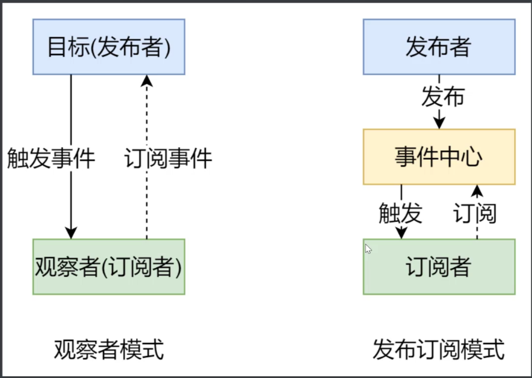

## 数据驱动

​	数据响应式：数据模型仅仅是普通的javascript对象，而当我们修改数据时，视图会进行更新，避免了繁琐的DOM操作，提高开发效率

​	双向绑定：数据改变，视图改变；视图改变，数据也随之改变

​	数据驱动：开发过程中仅需要关注数据本身，不需要关心数据是如何渲染到视图

### 发布订阅模式

​	我们假定存在一个'信号中心'，某个任务执行完成，就向信号中心发布一个信号，其他任务可以向信号中心订阅这个信号，从而知道什么时候自己可以开始执行。

### 观察者模式

- 观察者(订阅者) ——watcher
  - updated()：当事件发生时，具体要做的事情
- 目标(发布者)——Dep
  - subs数组，存储所有的观察者
  - addSub()：添加观察者
  - notify()：当事件发生，调用所有观察者的update()方法
- 没有事件中心

### 发布订阅和观察者模式的区别

- **观察者模式**是由具体目标调度，比如当事件触发，Dep就会去调用观察者的方法，所以观察者模式的订阅者与发布者之间是存在依赖的
- **发布订阅模式**是由统一调度中心调用，事件中心起到隔离发布者和订阅者，减少发布者和订阅者之间的依赖关系，因此发布者和订阅者不需要知道对方的存在

